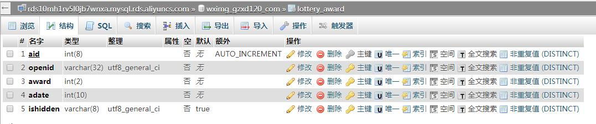
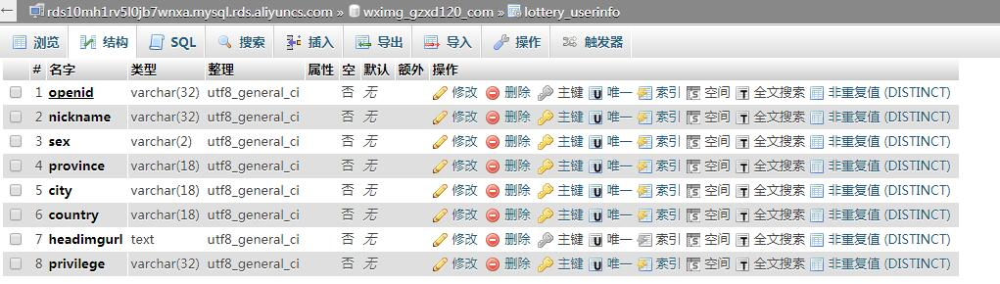
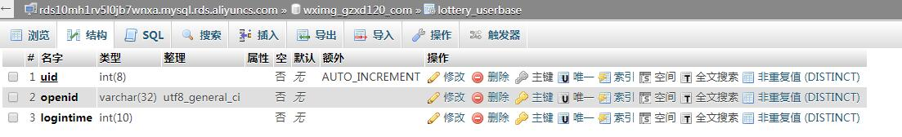

# LotteryBox
HTML抽奖转盘，随机数概率式抽奖

# 优势 #
加入预期抽奖人数，解决所有人抽完奖，奖项还没抽完的情况

# 备注 #
./create\_award\_pool.php   用于生成奖池，用于初始化奖池文件

# 涉及内容 #
1. PHP + MySQL
2. HTML5 canvas 绘图技术
3. MySQL多表查询
4. bootstrap前端布局
5. jQuery ajax请求
6. 微信服务号授权登录
7. 微信JS-SDK自定义分享内容
8. 奖品数组转化为json保存到文件
9. 并发访问文件锁
10. PHP随机数概率控制
11. PHP文件读写操作

# MySQL Table #
1.lottery_award

2.lottery_userinfo

3.lottery_userbase

###